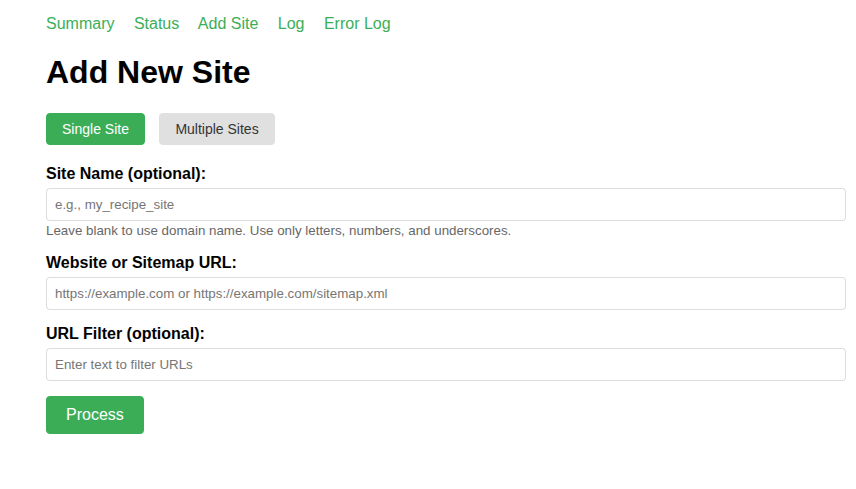
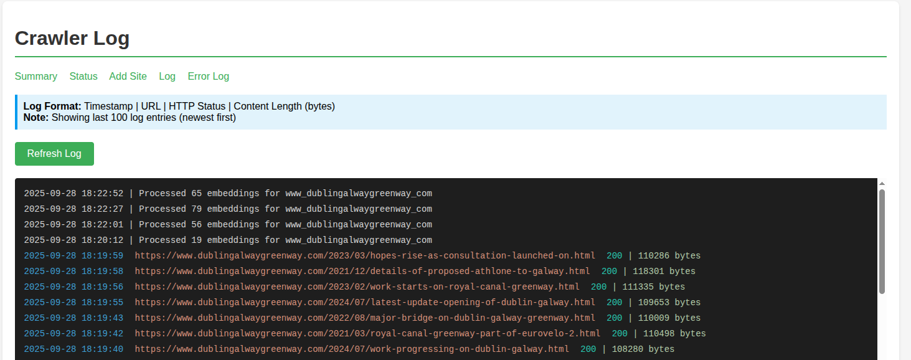
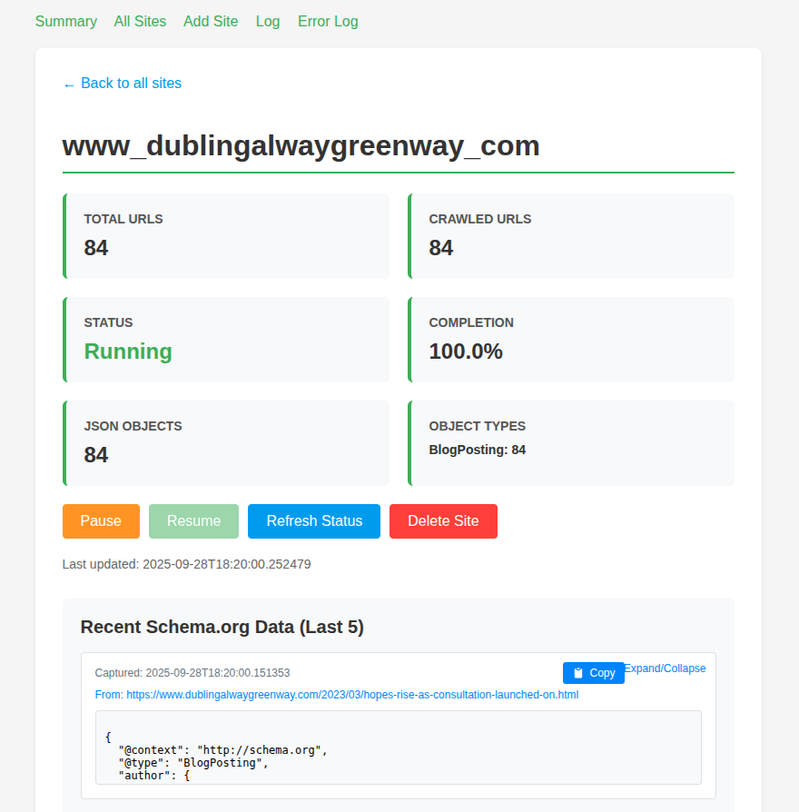

# NLWeb Crawler

A comprehensive web crawling system with vector database integration for the NLWeb AI platform. This crawler extracts content from websites, generates embeddings, and stores them in a vector database for semantic search and retrieval.


## Overview

The NLWeb Crawler is a multi-threaded, asynchronous web crawling system that:

- **Crawls websites** based on sitemaps and robots.txt
- **Extracts structured data** (schema.org JSON-LD) from web pages
- **Generates embeddings** using the NLWeb embedding library
- **Stores vectors** in Qdrant or other vector databases
- **Provides a web interface** for managing crawl operations
- **Integrates seamlessly** with the NLWeb AI platform

## Key Features

### 🚀 New Functionality

1. **Embeddings Worker**: Automatically generates embeddings for crawled content using the NLWeb submodule's embedding library
2. **Database Worker**: Monitors embedding files and inserts vectors into the configured vector database
3. **Vector Database Integration**: Full integration with Qdrant and other vector databases through the NLWeb submodule
4. **Site Deletion**: Complete removal of sites from both local storage and vector database
5. **Submodule Integration**: Reuses database loading and embedding libraries from the NLWeb project

### 📊 Core Capabilities

- **Multi-site crawling** with independent status tracking
- **Pause/resume functionality** for individual sites
- **Real-time monitoring** with web-based dashboard
- **Error tracking** and comprehensive logging
- **Docker containerization** for easy deployment
- **Schema.org extraction** for structured data harvesting

## Screenshots

### Adding a New Site


### Monitoring Crawler Logs


### Viewing Site Data


## Quick Start

### Prerequisites

- Python 3.8+
- Docker and Docker Compose (for containerized deployment)
- Git with submodule support

### Installation

1. **Clone the repository with submodules**:
   ```bash
   git clone --recurse-submodules https://github.com/nlweb-ai/crawler.git
   cd crawler
   ```

   Or if you already cloned without submodules:
   ```bash
   git clone https://github.com/nlweb-ai/crawler.git
   cd crawler
   git submodule update --init --recursive
   ```

2. **Set up environment variables**:
   ```bash
   cp .env.example .env
   # Edit .env with your configuration
   ```

3. **Choose your deployment method**:

#### Option A: Docker Deployment (Recommended)

```bash
# Start with Qdrant database
docker-compose -f docker-compose.yml -f docker-compose.qdrant.yml up --build

# Or use external Qdrant instance
docker-compose up --build
```

#### Option B: Local Development

```bash
# Install dependencies
pip install -r requirements.txt

# Start the application
python run.py
```

### Configuration

The crawler requires configuration for:

- **Vector Database**: Qdrant URL and API key
- **Embedding Provider**: OpenAI, Azure OpenAI, or other supported providers
- **Logging**: Log levels and file locations

Key configuration files:
- `config/config_retrieval.yaml` - Vector database settings
- `config/config_embedding.yaml` - Embedding provider settings
- `.env` - Environment variables

## Usage

1. **Access the web interface**: Navigate to `http://localhost:5000`

2. **Add a website to crawl**:
   - Enter a website URL or direct sitemap URL
   - Optionally add a filter to include only specific URLs
   - Click "Process" to start URL collection

3. **Monitor crawling progress**:
   - View the status page to see all active crawls
   - Check individual site progress and statistics
   - Monitor logs for detailed crawling information

4. **Manage sites**:
   - Pause/resume individual site crawls
   - Delete sites (removes all data including vectors)
   - Restart crawls from scratch

## Architecture

### System Components

1. **Flask Web Application** (`app.py`)
   - Web interface for site management
   - Sitemap processing and URL extraction
   - Status monitoring and control

2. **Async Crawler** (`crawler.py`)
   - Multi-threaded crawling engine
   - URL queue management
   - Content extraction and processing

3. **Embeddings Worker**
   - Monitors JSON files for new content
   - Generates embeddings using NLWeb library
   - Stores embeddings in JSON format

4. **Database Worker**
   - Monitors embedding files
   - Uploads vectors to configured database
   - Tracks processed items

### Data Flow

```
Website → Sitemap → URLs → Crawler → HTML + JSON-LD → Embeddings → Vector Database
```

### Directory Structure

```
crawler/
├── data/
│   ├── urls/           # URL lists per site
│   ├── docs/           # Crawled HTML content
│   ├── json/           # Extracted schema.org data
│   ├── embeddings/     # Generated embeddings
│   ├── keys/           # Processed item tracking
│   └── status/         # Crawl status files
├── config/             # Configuration files
├── logs/               # Application logs
├── nlweb-submodule/    # NLWeb library integration
└── templates/          # Web interface templates

## NLWeb Submodule Integration

This crawler integrates with the NLWeb project through a Git submodule to reuse:

- **Database loading utilities** for vector database operations
- **Embedding libraries** for content vectorization
- **Configuration management** for consistent settings

### Submodule Setup

The `setup_submodule_path.py` module automatically configures the Python path to import from the NLWeb submodule:

```python
import setup_submodule_path  # This automatically sets up the submodule path
```

This allows the crawler to import and use:
- `core.embedding.get_embedding()` - For generating embeddings
- `core.retriever.upload_documents()` - For database uploads
- `core.retriever.delete_documents_by_site()` - For site deletion

### Updating the Submodule

To get the latest updates from the NLWeb project:

```bash
git submodule update --remote nlweb-submodule
```

## Database Compatibility

### Qdrant Integration

The crawler is designed to work with Qdrant vector database:

- **Shared Database**: Both crawler and NLWeb can use the same Qdrant instance
- **Docker Network**: Uses `qdrant-net` network for container communication
- **API Key**: Shared authentication through environment variables

### Important Notes

⚠️ **Database Locking**: The crawler cannot work with Qdrant local database simultaneously with NLWeb, as Qdrant local only supports single connections. Use Qdrant server (Docker) for multi-application access.

**Recommended Setup**:
- Run Qdrant as a Docker container
- Configure both crawler and NLWeb to use the same Qdrant URL
- Use the same API key in both applications

## Environment Variables

Key environment variables for `.env` file:

```bash
# Qdrant Configuration
QDRANT_URL=http://localhost:6333
QDRANT_API_KEY=your_secret_key

# Embedding Provider
OPENAI_API_KEY=your_openai_key
AZURE_OPENAI_API_KEY=your_azure_key

# Application Settings
FLASK_ENV=development
PYTHONPATH=/app:/app
```

## Development

### Running Tests

```bash
# Run crawler tests
python -m pytest tests/

# Test with real sitemap
python run.py
# Navigate to http://localhost:5000
# Add test site: example.com/sitemap.xml
```

### Debugging

- **Logs**: Check `logs/` directory for detailed information
- **Status Files**: Monitor `data/status/` for crawl progress
- **Error Tracking**: View error counts in the web interface

### Contributing

1. Fork the repository
2. Create a feature branch
3. Make your changes
4. Test with real sitemaps
5. Submit a pull request

## Troubleshooting

### Common Issues

1. **Submodule not initialized**:
   ```bash
   git submodule update --init --recursive
   ```

2. **Qdrant connection failed**:
   - Check QDRANT_URL in environment
   - Ensure Qdrant container is running
   - Verify network connectivity

3. **Permission errors**:
   ```bash
   chmod -R 755 data/ logs/
   ```

4. **Import errors from submodule**:
   - Verify submodule is properly initialized
   - Check that `setup_submodule_path.py` is imported first

## License

This project is licensed under the MIT License - see the [LICENSE](LICENSE) file for details.

## Support

For issues and questions:
- Create an issue on GitHub
- Check the [documentation](docs/) for detailed information
- Review logs for error details
```
